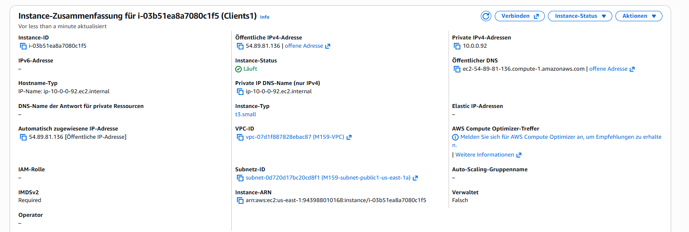
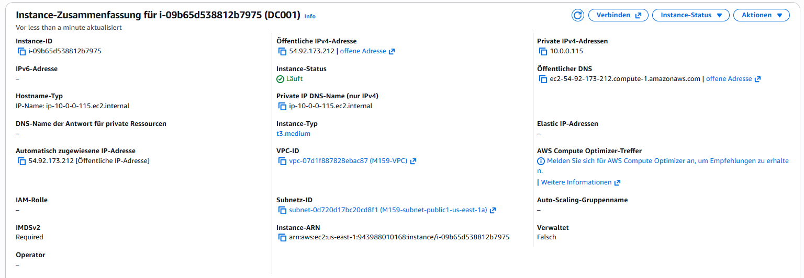
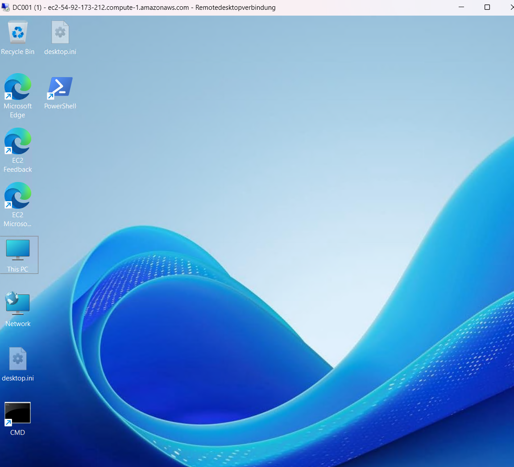

# LB2 – Initial Setup: Umsetzungsanleitung

Diese Doku beschreibt, wie du den Auftrag aus dem Readme ("Initial Setup") umsetzt: AWS-EC2-Umgebung gemäss Planung aufsetzen und die geforderten Windows-Einstellungen vornehmen.

---

## 1. AWS-EC2 gemäss Planung aufsetzen

### 1.1 VPC, Subnetze und Security Groups (VPC-Assistent)

1. AWS-Konsole → **VPC** → **Create VPC** → Option **"VPC and more"** wählen (das ist der Assistent).
2. Einstellungen im Assistenten:
   - **Name tag**: z. B. `M159-VPC`
   - **IPv4 CIDR**: `10.0.0.0/16`
   - **Number of Availability Zones**: 2
   - **Number of public subnets**: 2
   - **Number of private subnets**: 2
   - **NAT gateways**: **None** (gemäss Auftrag – kein Internetzugang für private Subnetze nötig; kann man später bei Bedarf einzeln nachrüsten, kostet aber laufend)
   - **VPC endpoints**: None (nicht nötig für diesen Auftrag)
3. Der Assistent erstellt automatisch: VPC, 4 Subnetze, Internet Gateway (nur für die öffentlichen Subnetze geroutet), Routentabellen.
4. Subnetz-CIDRs im Assistenten so anpassen, dass sie zu deiner Planung passen (bzw. die vom Assistenten vorgeschlagenen übernehmen und in dein Setup-Sheet eintragen).
5. Nach der Erstellung: Subnetze umbenennen gemäss Namenskonvention aus dem Sheet (`M159-subnet-public1-us-east-1a` usw.), falls der Assistent generische Namen vergeben hat.

### 1.2 Security Groups konfigurieren

1. **VPC → Security Groups** → die vom Assistenten erstellten Security Groups (oder neue) auswählen.
2. Zwei Security Groups gemäss deinem Setup-Sheet konfigurieren:
   - **SG „DC"**: Inbound-Regeln für RDP, LDAP, LDAPS, Kerberos, SMB, DNS, RPC, ICMP, Global Catalog, Kerberos Password Change (siehe Tabelle 5 im Setup-Sheet).
   - **SG „Clients"**: Inbound-Regeln für RDP, Kerberos, RPC, NetBIOS, LDAP, DNS, SMB, RPC Ephemeral Ports, ICMP – Quelle jeweils die internen CIDRs.
3. Tipp: Zuerst Regeln in einer SG anlegen, dann bei der zweiten SG mit **"Copy to new security group"** Zeit sparen und danach anpassen.

### 1.3 EC2-Instanzen erstellen

1. **EC2 → Launch Instance**, pro Server (DC, Client, ggf. Admin Center) einzeln:
   - **Name**: identisch mit dem geplanten **Hostname** (wichtig laut Auftrag – Instanzname = Hostname, z. B. `DC`, `CLIENT`).
   - **AMI**: Windows Server (Core oder mit Desktop Experience, je nach Planung).
   - **Instance type**: passend zur Last (z. B. `t3.medium`).
   - **Key pair**: vorhanden/neu erstellen (zum Auslesen des Admin-Passworts).
2. **Network settings** → **Edit**:
   - Richtige **VPC** und **Subnetz** auswählen (nicht die AWS-Vorauswahl übernehmen!).
   - **Auto-assign public IP**: nur bei Instanzen in öffentlichen Subnetzen aktivieren.
   - **Advanced network configuration** → **Private IP address**: die geplante IP aus deinem Setup-Sheet **manuell eintragen** – sonst vergibt AWS automatisch eine beliebige freie IP aus dem Subnetz, was laut Auftrag vermieden werden soll.
   - Richtige **Security Group** zuweisen.
3. Instanz starten, danach **Elastic IP** reservieren und der Instanz zuweisen, falls sie öffentlich erreichbar sein soll (feste öffentliche IP statt wechselnder Auto-IP).
4. Wiederholen für jede weitere Instanz.

---

## 2. Windows-Einstellungen vornehmen

Für die folgenden Punkte gibt es ein fertiges PowerShell-Skript (`Configure-WindowsSettings.ps1`), das die meisten Schritte automatisiert erledigt. Manuelle Beschreibung trotzdem hier festgehalten, falls du etwas einzeln nachvollziehen oder manuell prüfen willst.

### 2.1 Hostname setzen (Core & Desktop)

- **Manuell**: *Server Manager* → *Local Server* → *Computer name* → *Change* → Namen setzen → Neustart.
- **Per Skript**: `Rename-Computer -NewName "<Name>" -Force` (im Skript enthalten).

### 2.2 Firewall – Ping erlauben (Core & Desktop)

- **Manuell**: *Windows Defender Firewall with Advanced Security* → *Inbound Rules* → Regeln **"File and Printer Sharing (Echo Request - ICMPv4-In)"** und ggf. ICMPv6 aktivieren.
- **Per Skript**: legt entsprechende Firewallregeln automatisch an.

### 2.3 Tastaturlayout CH (Core & Desktop)

- **Manuell**: *Settings* → *Time & Language* → *Language* → Tastaturlayout **Swiss German (CH)** hinzufügen/als Standard setzen. Auf Core via `intl.cpl` oder PowerShell.
- **Per Skript**: `Set-WinUserLanguageList -LanguageList de-CH` + Default Input Method.

### 2.4 Verstärkte Sicherheitskonfiguration für IE ausschalten (nur Desktop)

- **Manuell**: *Server Manager* → *Local Server* → **IE Enhanced Security Configuration** → für Administrators und Users jeweils auf **Off** setzen.
- **Per Skript**: setzt die entsprechenden Registry-Keys (`IsInstalled = 0`) für Admin- und User-Komponente. Wird bei Server Core automatisch übersprungen (dort nicht vorhanden, da kein IE installiert ist).

### 2.5 Netzwerkadapter – TCP/IPv6 deaktivieren (Core & Desktop)

- **Manuell**: *Netzwerkadapter-Einstellungen* → Adapter-Eigenschaften → Häkchen bei **„Internetprotokoll Version 6 (TCP/IPv6)"** entfernen.
- **Per Skript**: `Disable-NetAdapterBinding -ComponentID ms_tcpip6` auf allen Adaptern.

### 2.6 Anzeige & Ordneroptionen (nur Desktop)

- **Manuell**: *Explorer* → *Ansicht* → *Optionen* → *Ordner- und Suchoptionen*:
  - „Erweiterungen bei bekannten Dateitypen ausblenden" **deaktivieren**
  - „Freigabeassistent verwenden" **deaktivieren**
  - „Geschützte Systemdateien ausblenden" **deaktivieren**, „Alle Dateien anzeigen" **aktivieren**
- **Per Skript**: setzt die entsprechenden Registry-Werte unter `HKCU:\...\Explorer\Advanced` direkt.

### 2.7 Desktopsymbole einblenden (nur Desktop)

- **Manuell**: Rechtsklick Desktop → *Anpassen* → *Designs* → *Desktopsymboleinstellungen* → Häkchen bei **Dieser PC**, **Systemsteuerung**, **Netzwerk** setzen.
- **Per Skript**: setzt die passenden `HideDesktopIcons`-Registry-Werte auf 0 (sichtbar).

### 2.8 Verknüpfungen für CMD und PowerShell (nur Desktop)

- **Manuell**: Rechtsklick auf Desktop → *Neu* → *Verknüpfung* → Pfad zu `cmd.exe` bzw. `powershell.exe` angeben.
- **Per Skript**: erstellt beide Verknüpfungen automatisch über COM-Objekt `WScript.Shell`.

---

## 3. Ausführungsreihenfolge (Empfehlung)

1. VPC + Subnetze + Security Groups erstellen (Kap. 1.1–1.2).
2. EC2-Instanzen mit korrekten Namen, IPs und Security Groups starten (Kap. 1.3).
3. Auf jedem Server per RDP verbinden und **`Configure-WindowsSettings.ps1`** ausführen (Hostname im Skript vorher anpassen!).
4. Neustart, danach Kontrolle: Hostname, Ping-Antwort, Tastaturlayout, IPv6 deaktiviert, (bei Desktop:) IE ESC aus, Ordneroptionen, Desktopsymbole, Verknüpfungen.
5. Danach weiter mit dem eigentlichen AD-Setup (siehe separate Anleitung `M159-Umsetzungsanleitung.md`).

