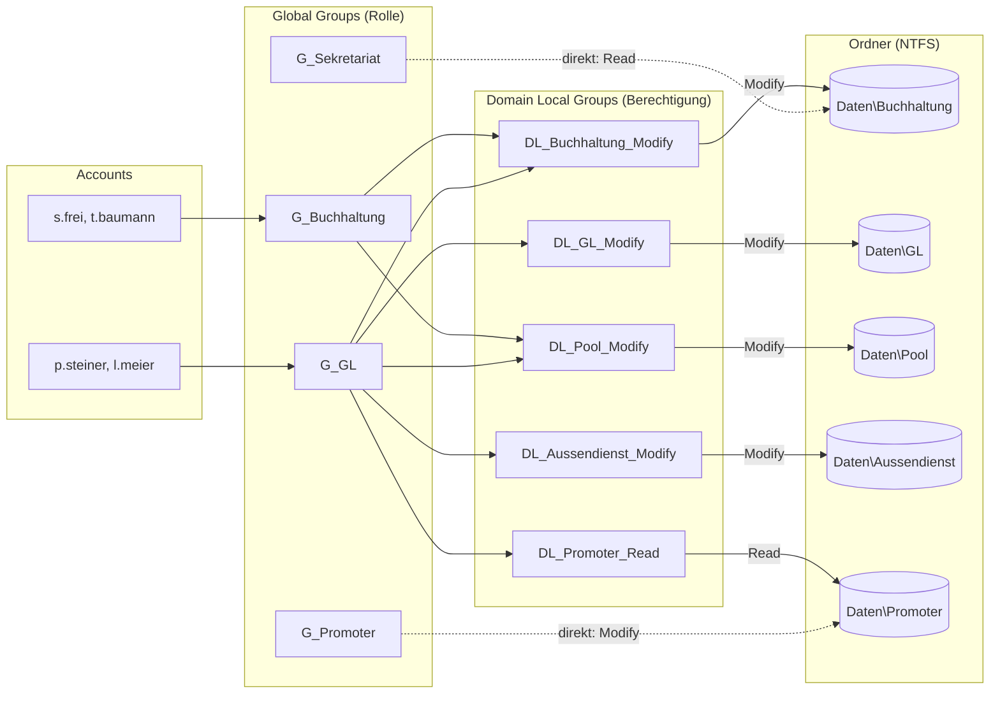

# LB2 – Freigaben, Laufwerke & Berechtigungen: Umsetzungsanleitung

Diese Doku beschreibt das Anlegen von Usern und Gruppen, die UNC-Grundlagen, das Erstellen von Ordnern und Freigaben mit ABE, die Vergabe von Freigabe- und NTFS-Berechtigungen, das Testen sowie ein eigenes Group-Nesting-Konzept nach AGDLP.

**Umgebung**

| Was | Wert |
|---|---|
| Domäne (DNS) | `dc001.tbz.m159` |
| NetBIOS-Name | `<NETBIOS>` (auslesen mit `(Get-ADDomain).NetBIOSName`) |
| Domain Controller / Fileserver | `DC01` (`10.0.0.115`) |
| Client | Windows Server (Desktop), Mitglied der Domäne |
| Ordnerstruktur | `C:\Freigaben\Daten` (bzw. `D:\Freigaben\Daten`, falls ein Laufwerk D: existiert) |
| Freigabe | `\\DC01\Daten` |

Die Umsetzung erfolgte mit einem PowerShell-Skript auf DC01. Die GUI-Schritte sind zusätzlich beschrieben, damit jeder Schritt nachvollziehbar und manuell prüfbar ist.

---

## 1. User und Gruppen anlegen

### 1.1 Organisationseinheiten

Im **Active Directory Users and Computers** (ADUC) zwei OUs direkt unter der Domäne:

- `Benutzer` für alle Benutzerkonten
- `Gruppen` für alle Sicherheitsgruppen

### 1.2 Benutzer erstellen

Pro Abteilung zwei Benutzer (Benutzername = erster Buchstabe des Vornamens, Punkt, Nachname):

| Abteilung   | Bereich | Benutzer 1 | Benutzer 2 |
|-------------|---------|------------|------------|
| Sekretariat | intern  | `a.keller` (Anna Keller) | `m.huber` (Marco Huber) |
| Buchhaltung | intern  | `s.frei` (Sandra Frei) | `t.baumann` (Thomas Baumann) |
| GL          | intern  | `p.steiner` (Peter Steiner) | `l.meier` (Laura Meier) |
| Promoter    | extern  | `n.brunner` (Nico Brunner) | `j.roth` (Julia Roth) |

- Testpasswort: `Passw0rd!159` (erfüllt die Komplexitätsanforderungen der Default Domain Policy: Gross-/Kleinbuchstaben, Zahl, Sonderzeichen, mind. 7 Zeichen).
- Passwort läuft nicht ab (`PasswordNeverExpires`), damit die Tests jederzeit möglich sind.
- Falls ein Passwort als zu schwach abgelehnt wird: zuerst Auftrag «9.1 Default Domain Policy – Passwortrichtlinien verändern» vorziehen.

Beispiel per PowerShell:
```powershell
New-ADUser -Name "Anna Keller" -GivenName Anna -Surname Keller -SamAccountName a.keller `
    -UserPrincipalName "a.keller@dc001.tbz.m159" -Path "OU=Benutzer,DC=dc001,DC=tbz,DC=m159" `
    -AccountPassword (ConvertTo-SecureString "Passw0rd!159" -AsPlainText -Force) `
    -Enabled $true -PasswordNeverExpires $true -Department Sekretariat
```

### 1.3 Globale Sicherheitsgruppen pro Abteilung

Für jede Abteilung eine Gruppe (Bereich **Global**, Typ **Security**) in der OU `Gruppen`. Die Benutzer der Abteilung werden Mitglied.

| Gruppe | Mitglieder |
|---|---|
| `G_Sekretariat` | `a.keller`, `m.huber` |
| `G_Buchhaltung` | `s.frei`, `t.baumann` |
| `G_GL` | `p.steiner`, `l.meier` |
| `G_Promoter` | `n.brunner`, `j.roth` |

### 1.4 Gruppen «Intern» und «Extern»

Zwei weitere globale Sicherheitsgruppen `Intern` und `Extern`. Als Mitglieder kommen **die Abteilungsgruppen** (nicht die einzelnen Benutzer) hinein:

| Gruppe | Mitglieder (Gruppen) |
|---|---|
| `Intern` | `G_Sekretariat`, `G_Buchhaltung`, `G_GL` |
| `Extern` | `G_Promoter` |

```powershell
Add-ADGroupMember -Identity "Intern" -Members "G_Sekretariat","G_Buchhaltung","G_GL"
Add-ADGroupMember -Identity "Extern" -Members "G_Promoter"
```

Das ist bereits eine Vorstufe von Group Nesting: Abteilungsgruppen werden in übergeordnete Gruppen verschachtelt, statt einzelne User überall neu zuzuweisen.

### 1.5 Testanmeldung

Alle Testbenutzer sind zusätzlich Mitglied der Gruppe `RDP-Users` (Konzept aus dem Auftrag «Gesamtstruktur & Client»). Dadurch dürfen sie sich per Remote Desktop am Client anmelden.

Kontrolle nach der Anmeldung auf dem Client:
```
whoami /groups
```
Die erwarteten Gruppen (z. B. `G_Buchhaltung`, `Intern`) müssen aufgelistet sein. Gruppenänderungen wirken erst nach einer neuen Anmeldung.

---

## 2. UNC-Grundlagen

Ein **UNC-Pfad** (Uniform Naming Convention) adressiert eine Netzwerkressource unabhängig von Laufwerksbuchstaben:

```
\\Servername\Freigabename\Unterordner
```

Beispiel in dieser Umgebung: `\\DC01\Daten\Buchhaltung`

- Funktioniert ohne zugewiesenen Laufwerksbuchstaben.
- Wird für Netzlaufwerke (Auftrag 7), Skripte und GPOs benötigt.
- Der Servername kann als Hostname (`DC01`) oder FQDN (`DC01.dc001.tbz.m159`) angegeben werden.

Quellen: [Wikipedia: Uniform Naming Convention](https://de.wikipedia.org/wiki/Uniform_Naming_Convention) und die Übung `uebung-unc.docx`.

---

## 3. Ordner und Freigaben erstellen + ABE aktivieren

### 3.1 Ordnerstruktur

Auf DC01 unter `C:\Freigaben\Daten`:

```
Daten
├── Sekretariat
├── Buchhaltung
├── GL
├── Pool
├── Aussendienst
└── Promoter
```

### 3.2 Berechtigungsmatrix

R = Read (NTFS: *Lesen, Ausführen*), C = Change (NTFS: *Ändern*), – = kein Zugriff (kein Eintrag).

<!-- HINWEIS: Diese Matrix mit dem Bild «05-table1.png» aus dem Auftrag abgleichen und bei Abweichungen anpassen. -->

| Ordner        | Sekretariat | Buchhaltung | GL | Promoter | LB (Auftrag 7) |
|---------------|:-----------:|:-----------:|:--:|:--------:|:--------------:|
| Sekretariat   | C | – | – | – | |
| Buchhaltung   | R | C | C | – | |
| GL            | – | – | C | – | |
| Pool          | C | C | C | – | |
| Aussendienst  | – | – | C | – | |
| Promoter      | – | – | R | C | |

Die Gruppen `Intern` und `Extern` erhalten auf `Daten` selbst nur *Lesen, Ausführen* **nur für diesen Ordner**. So können alle Benutzer die Freigabe betreten, und ABE (Kap. 5) blendet alles aus, worauf sie keine Rechte haben.

### 3.3 Freigabe erstellen (Freigabeberechtigung)

1. Rechtsklick auf `Daten` → *Properties* → *Sharing* → *Advanced Sharing*.
2. *Share this folder* aktivieren, Freigabename `Daten`.
3. *Permissions* → **Everyone** → **Change** erlauben (Freigabeberechtigung, nicht NTFS).

```powershell
New-SmbShare -Name "Daten" -Path "C:\Freigaben\Daten" -ChangeAccess "Everyone" -FolderEnumerationMode AccessBased
```

Die Freigabeberechtigung «Jeder = Ändern» ist bewusst grosszügig. Die eigentliche Steuerung erfolgt über NTFS. Freigabe- und NTFS-Berechtigungen werden kombiniert, es gilt immer die **restriktivere**.

### 3.4 Vererbung deaktivieren

Auf `Daten` und **allen Unterordnern**:

1. Rechtsklick → *Properties* → *Security* → *Advanced* → **Disable inheritance**.
2. Es werden nur noch die explizit gesetzten Einträge verwendet.

```powershell
icacls "C:\Freigaben\Daten" /inheritance:r
```

Danach sind auf jedem Ordner nur noch **SYSTEM** und **Administratoren** (Vollzugriff) eingetragen, alle übrigen Rechte werden gezielt neu vergeben.

### 3.5 Standardgruppe «Domänen-Benutzer» entfernen

Auf jedem Ordner muss die Gruppe **Domänen-Benutzer** (`Domain Users`, SID endet auf `-513`) sowie die lokale Gruppe `Users` entfernt sein. Sonst hätte jeder angemeldete Domänenbenutzer Zugriff und die Matrix würde unterlaufen.

```powershell
icacls "C:\Freigaben\Daten\Buchhaltung" /remove "*<Domain-SID>-513"
```

### 3.6 NTFS-Berechtigungen nach Matrix

Pro Ordner die Abteilungsgruppen aus Kap. 1.3 mit den Rechten aus Kap. 3.2 eintragen:

1. *Properties* → *Security* → *Edit* → *Add* → Gruppe eingeben → *Check Names*.
2. **R** → *Read & execute*, **C** → *Modify*.

```powershell
icacls "C:\Freigaben\Daten\Buchhaltung" /grant "<NETBIOS>\G_Buchhaltung:(OI)(CI)(M)"
icacls "C:\Freigaben\Daten\Buchhaltung" /grant "<NETBIOS>\G_Sekretariat:(OI)(CI)(RX)"
```
(`M` = Modify, `RX` = Read & Execute, `(OI)(CI)` = Vererbung auf Unterordner und Dateien)

Kontrolle: `icacls "C:\Freigaben\Daten\Buchhaltung"` bzw. im Explorer unter *Security*.

---

## 4. Berechtigungen testen

Anmeldung am Client per RDP mit dem jeweiligen Testbenutzer, dann UNC-Pfad im Explorer aufrufen und eine Textdatei anlegen.

| Test | Benutzer (Abteilung) | UNC-Pfad | Erwartet | Ergebnis |
|---|---|---|---|---|
| 1 | `a.keller` (Sekretariat) | `\\DC01\Daten\Buchhaltung` | Lesen ja, Schreiben nein | *Screenshot einfügen* |
| 2 | `p.steiner` (GL) | `\\DC01\Daten\Pool` | Schreiben ja | *Screenshot einfügen* |
| 3 | `n.brunner` (Promoter) | `\\DC01\Daten\Aussendienst` | kein Zugriff | *Screenshot einfügen* |

Falls ein Test nicht wie erwartet ausfällt:
- Gruppenmitgliedschaft prüfen (`whoami /groups` nach neuer Anmeldung).
- Freigabe- **und** NTFS-Berechtigung prüfen, das restriktivere Recht gewinnt.
- Prüfen, ob die Vererbung deaktiviert und «Domänen-Benutzer» überall entfernt ist.

---

## 5. ABE (Access-Based Enumeration)

### 5.1 Was ist ABE?

Access-Based Enumeration zeigt einem Benutzer in einer Freigabe nur die Ordner und Dateien an, auf die er mindestens Leserechte hat. Ordner ohne Berechtigung sind im Explorer nicht sichtbar, statt erst beim Öffnen eine Fehlermeldung zu liefern. Das schützt die Struktur sensibler Ordner vor neugierigen Blicken und macht die Ansicht übersichtlicher.

ABE prüft die **NTFS-Rechte**. Deshalb brauchen `Intern` und `Extern` das Recht *Lesen, Ausführen* auf `Daten`, sonst könnte niemand die Freigabe betreten.

### 5.2 ABE aktivieren

*Server Manager* → *File and Storage Services* → *Shares* → Freigabe → *Properties* → *Settings* → **Enable access-based enumeration**.

```powershell
Set-SmbShare -Name "Daten" -FolderEnumerationMode AccessBased -Force
Get-SmbShare -Name "Daten" | Select-Object Name, FolderEnumerationMode
```

### 5.3 Test

Als `n.brunner` (Promoter) `\\DC01\Daten` öffnen: Es sind nur die Ordner sichtbar, auf die Promoter Zugriff hat (`Promoter`). `Buchhaltung`, `Pool` und `Aussendienst` erscheinen gar nicht. *Screenshot einfügen.*

---

## 6. Eigenes Group-Nesting-Konzept (AGDLP)

### 6.1 Schwachstelle der vorgegebenen Struktur

In der Vorgabe erhalten die Abteilungsgruppen ihre NTFS-Rechte **direkt** auf den Ordnern. Das hat Nachteile:

- Rolle (Abteilungszugehörigkeit) und Berechtigung (Recht auf eine Ressource) sind vermischt.
- Ändert sich, wer worauf Zugriff braucht, muss an den Ordnern selbst gearbeitet werden. Bei vielen Ordnern ist das aufwendig und fehleranfällig.
- Es ist schwer nachzuvollziehen, welche Gruppe auf welchem Ordner welches Recht hat.

### 6.2 AGDLP-Prinzip

**A**ccounts → **G**lobal Groups → **D**omain **L**ocal Groups → **P**ermissions

| Ebene | Zweck |
|---|---|
| **A**ccounts | Einzelne Benutzerkonten |
| **G**lobal Groups | Fassen Benutzer nach Rolle/Abteilung zusammen (`G_Buchhaltung`, `G_GL`) |
| **D**omain **L**ocal Groups | Fassen die Berechtigung auf **eine** Ressource zusammen, benannt `DL_<Ordner>_<Recht>` |
| **P**ermissions | Werden nur an Domain-Local-Gruppen vergeben, nie direkt an User oder globale Gruppen |

Vorteil: Wer welche Rolle hat, und wer welches Recht bekommt, sind zwei getrennte Fragen. Eine Rolle kann in mehrere DL-Gruppen aufgenommen werden, ohne die Ordner anzufassen.

### 6.3 Neue Struktur für zwei Abteilungen

Umgestellt wurden die Abteilungen **Buchhaltung** und **GL**. `G_Sekretariat` und `G_Promoter` behalten vorerst ihre direkten Rechte.

| Domain-Local-Gruppe | NTFS-Recht auf | Mitglieder (Global Groups) |
|---|---|---|
| `DL_Buchhaltung_Modify` | `Daten\Buchhaltung` | `G_Buchhaltung`, `G_GL` |
| `DL_GL_Modify` | `Daten\GL` | `G_GL` |
| `DL_Pool_Modify` | `Daten\Pool` | `G_Buchhaltung`, `G_GL` |
| `DL_Aussendienst_Modify` | `Daten\Aussendienst` | `G_GL` |
| `DL_Promoter_Read` | `Daten\Promoter` | `G_GL` |

Direkt vergeben (nicht umgestellt): `G_Sekretariat` (Read auf Buchhaltung, Change auf Sekretariat und Pool), `G_Promoter` (Change auf Promoter).



### 6.4 Umsetzung

1. Domain-Local-Gruppen in der OU `Gruppen` anlegen:
   ```powershell
   New-ADGroup -Name "DL_Buchhaltung_Modify" -GroupScope DomainLocal -GroupCategory Security -Path "OU=Gruppen,DC=dc001,DC=tbz,DC=m159"
   ```
2. Globale Gruppen als Mitglieder eintragen:
   ```powershell
   Add-ADGroupMember -Identity "DL_Buchhaltung_Modify" -Members "G_Buchhaltung","G_GL"
   ```
3. Auf dem Ordner den direkten Eintrag der globalen Gruppe entfernen und stattdessen die DL-Gruppe eintragen:
   ```powershell
   icacls "C:\Freigaben\Daten\Buchhaltung" /remove:g "<NETBIOS>\G_Buchhaltung"
   icacls "C:\Freigaben\Daten\Buchhaltung" /grant:r "<NETBIOS>\DL_Buchhaltung_Modify:(OI)(CI)(M)"
   ```
4. Alle Benutzer melden sich neu an, damit die neuen Gruppenmitgliedschaften im Kerberos-Ticket erscheinen.
5. Die Tests aus Kap. 4 wiederholen. Die Zugriffe müssen **unverändert** sein, nur die Struktur dahinter ist sauberer.

Kontrolle der neuen Gruppen:
```powershell
Get-ADGroup -Filter "Name -like 'DL_*'" | ForEach-Object {
    "{0} <- {1}" -f $_.Name, ((Get-ADGroupMember $_).Name -join ', ')
}
```

### 6.5 Warum ist das besser?

- **Trennung von Rolle und Recht:** Neue Mitarbeitende kommen nur in die Rollengruppe, die Ordner werden nicht angefasst.
- **Übersicht:** Der Gruppenname verrät Ordner und Recht (`DL_Pool_Modify`). Wer Zugriff hat, sieht man an den Mitgliedern der DL-Gruppe.
- **Änderungen an einer Stelle:** Ein zusätzliches Team bekommt Zugriff auf `Pool`, indem seine globale Gruppe Mitglied von `DL_Pool_Modify` wird.
- **Skalierbarkeit:** Funktioniert auch bei mehreren Domänen, weil globale Gruppen domänenübergreifend in DL-Gruppen aufgenommen werden können.

---

## 7. Zusammenfassung / Begründungen

- **Freigabe- vs. NTFS-Rechte:** Die Freigabe (`Jeder = Ändern`) ist die grobe Tür ins Netzwerk, NTFS regelt fein, wer was darf. Es gilt die restriktivere Kombination.
- **Vererbung aus, Domänen-Benutzer entfernt:** Damit kommt niemand über Standardrechte an Ordner, die er laut Matrix nicht sehen darf.
- **ABE:** Nicht zugängliche Ordner werden gar nicht erst angezeigt.
- **AGDLP:** Rollen (global) und Berechtigungen (domänenlokal) sind getrennt, was Änderungen einfacher und weniger fehleranfällig macht.