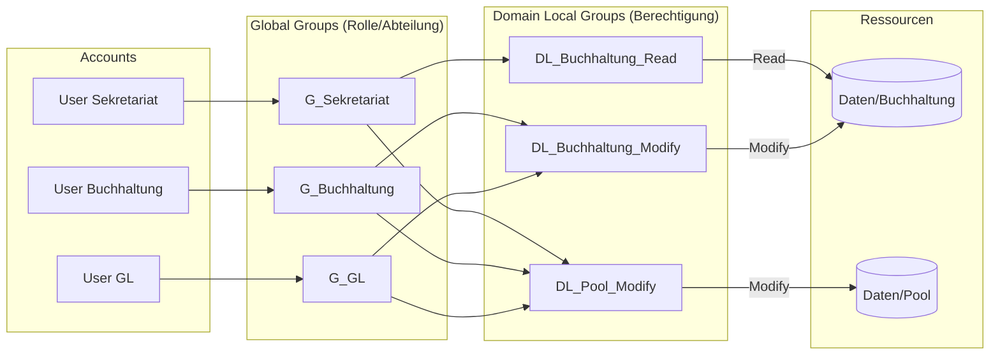

# LB2 – Freigaben, Laufwerke & Berechtigungen: Umsetzungsanleitung

Diese Doku führt durch das Anlegen von Usern/Gruppen, die UNC-Grundlagen, das Erstellen von Ordnern/Freigaben mit ABE, die Vergabe von Freigabe- und NTFS-Berechtigungen, das Testen sowie ein eigenes Group-Nesting-Konzept nach AGDLP.

> **Hinweis:** Konkrete Namen (Domäne, Ordnerstruktur, genaue Berechtigungsmatrix) richten sich nach deiner eigenen Planung (Setup-Sheet, Kap. 8 „Abteilungen & Benutzer" sowie die Berechtigungstabelle aus dem Auftrag). Ersetze die Platzhalter unten durch deine tatsächlichen Werte.

---

## 1. User und Gruppen anlegen

### 1.1 Benutzer erstellen

Auf DC1 im **Active Directory Users and Computers** (ADUC) bzw. im **Active Directory Administrative Center**:

1. Für jede Abteilung mindestens einen Benutzer anlegen, wie in der Planung definiert (Setup-Sheet Kap. 8):

   | Abteilung   | Bereich | Beispiel-Benutzername |
   |-------------|---------|------------------------|
   | Sekretariat | intern  | `s.muster` |
   | Buchhaltung | intern  | `b.muster` |
   | GL          | intern  | `g.muster` |
   | Promoter    | extern  | `p.muster` |

2. Passwort vergeben (Komplexitätsanforderungen der Default Domain Policy beachten).
   - Falls das Passwort als zu schwach abgelehnt wird: zuerst Auftrag **„9.1 Default Domain Policy – Passwortrichtlinien ändern"** vorziehen.
3. **User must change password at next logon** je nach Vorgabe setzen oder deaktivieren.

Alternativ per PowerShell:
```powershell
New-ADUser -Name "Vorname Nachname" -SamAccountName "s.muster" `
    -UserPrincipalName "s.muster@m159.tbz" `
    -Path "OU=Benutzer,DC=m159,DC=tbz" `
    -AccountPassword (Read-Host -AsSecureString "Passwort") `
    -Enabled $true
```

### 1.2 Globale Sicherheitsgruppen pro Abteilung

Für **jede Abteilung** eine globale Sicherheitsgruppe anlegen (Bereich: **Global**, Typ: **Security**):

| Gruppenname       | Enthält Benutzer aus |
|-------------------|-----------------------|
| `G_Sekretariat`   | Abteilung Sekretariat |
| `G_Buchhaltung`   | Abteilung Buchhaltung |
| `G_GL`            | Abteilung GL |
| `G_Promoter`      | Abteilung Promoter |

```powershell
New-ADGroup -Name "G_Sekretariat" -GroupScope Global -GroupCategory Security -Path "OU=Gruppen,DC=m159,DC=tbz"
Add-ADGroupMember -Identity "G_Sekretariat" -Members "s.muster"
```

### 1.3 Gruppen „intern" und „extern"

Zusätzlich **zwei** weitere globale Sicherheitsgruppen anlegen:

- `Intern`
- `Extern`

Anschliessend die **Abteilungsgruppen** (nicht die einzelnen User!) als Mitglieder in diese beiden Gruppen einfügen – je nachdem, ob die Abteilung laut Planung intern oder extern ist:

| Gruppe   | Enthält (Mitglied) |
|----------|---------------------|
| `Intern` | `G_Sekretariat`, `G_Buchhaltung`, `G_GL` |
| `Extern` | `G_Promoter` |

```powershell
Add-ADGroupMember -Identity "Intern" -Members "G_Sekretariat","G_Buchhaltung","G_GL"
Add-ADGroupMember -Identity "Extern" -Members "G_Promoter"
```

> Das ist bereits eine Vorstufe von **Group Nesting** (Gruppe-in-Gruppe): Abteilungsgruppen werden in übergeordnete Gruppen verschachtelt, statt einzelne User überall neu zuzuweisen.

### 1.4 Testanmeldung

Mit mindestens einem Benutzer pro Abteilung am Windows-Client anmelden, um zu prüfen, dass:
- die Anmeldung grundsätzlich funktioniert,
- der Benutzer in den erwarteten Gruppen Mitglied ist (`whoami /groups` auf dem Client).

---

## 2. UNC-Grundlagen

Ein **UNC-Pfad** (Uniform Naming Convention) adressiert eine Netzwerkressource unabhängig von gemappten Laufwerksbuchstaben, nach dem Schema:

```
\\Servername\Freigabename\Unterordner
```

Beispiel: `\\dc1\Daten\Buchhaltung`

- Funktioniert unabhängig davon, ob ein Laufwerksbuchstabe zugewiesen ist.
- Wird u. a. für Netzlaufwerke (siehe Auftrag 7), Skripte und GPOs benötigt.
- Siehe [Wikipedia: Uniform Naming Convention](https://de.wikipedia.org/wiki/Uniform_Naming_Convention) sowie die Übung `uebung-unc.docx` aus den Unterrichtsressourcen.

---

## 3. Ordner- und Freigabestruktur erstellen + ABE aktivieren

### 3.1 Ordnerstruktur anlegen

Auf DC1 (oder dem vorgesehenen Fileserver) lokal die Ordnerstruktur gemäss der Vorgabetabelle aus dem Auftrag anlegen, z. B. unter `D:\Freigaben\`:

```
D:\Freigaben\Daten
D:\Freigaben\Daten\Sekretariat
D:\Freigaben\Daten\Buchhaltung
D:\Freigaben\Daten\GL
D:\Freigaben\Daten\Pool
D:\Freigaben\Daten\Aussendienst
```

> Die exakten Ordnernamen und die zugehörige Berechtigungsmatrix (R/C/– pro Abteilung und Ordner) entnimmst du der Tabelle im Auftrag («05-table1.png»). Trage sie dir am besten in eine eigene Tabelle in dieser Doku ein, z. B.:

| Ordner        | Sekretariat | Buchhaltung | GL | Promoter | LB (Auftrag 7) |
|---------------|:-----------:|:-----------:|:--:|:--------:|:---------------:|
| Buchhaltung   | R           | C           | C  | –        | |
| Pool          | C           | C           | C  | –        | |
| Aussendienst  | –           | –           | C  | C        | |
| …             |             |             |    |          | |

*(R = Read, C = Change, – = kein Zugriff — Werte hier durch deine tatsächliche Matrix ersetzen; für die volle Punktzahl reichen die grün markierten Zeilen aus dem Auftrag.)*

### 3.2 Freigaben erstellen

Für die oberste Ebene (`Daten`) und ggf. weitere separat definierte Freigaben:

1. Rechtsklick auf den Ordner → **Properties** → Tab **Sharing** → **Advanced Sharing**.
2. **Share this folder** aktivieren, Freigabename vergeben (z. B. `Daten`).
3. Auf **Permissions** klicken → **Everyone** → Häkchen bei **Change** setzen (Freigabeberechtigung, nicht NTFS!).
4. Mit **OK** bestätigen.

Alternativ per PowerShell:
```powershell
New-SmbShare -Name "Daten" -Path "D:\Freigaben\Daten" -FullAccess "Everyone"
# oder gezielt nur Change:
Grant-SmbShareAccess -Name "Daten" -AccountName "Everyone" -AccessRight Change -Force
```

> **Wichtig:** Die Freigabeberechtigung «Jeder = Ändern/Change» ist bewusst grosszügig – die eigentliche Feinsteuerung erfolgt über die **NTFS-Berechtigungen** (siehe 3.4). Freigabe- und NTFS-Berechtigungen werden kombiniert; es gilt immer die **restriktivere** der beiden.

### 3.3 Vererbung auf «Daten» und Unterordnern deaktivieren

1. Rechtsklick auf den Ordner `Daten` → **Properties** → Tab **Security** → **Advanced**.
2. **Disable inheritance** klicken.
3. Im Dialog **Convert inherited permissions into explicit permissions on this object** wählen (damit die bisherigen Berechtigungen erst mal erhalten bleiben, bevor du sie bereinigst).
4. Diesen Schritt für **jeden Unterordner** von `Daten` wiederholen (Sekretariat, Buchhaltung, GL, Pool, Aussendienst, …).

### 3.4 Standardgruppe «Domänenbenutzer» entfernen

Nach dem Deaktivieren der Vererbung ist auf jedem Ordner meist noch die Gruppe **Domänen-Benutzer** (Domain Users) mit Vollzugriff/Lesen vorhanden (aus der Konvertierung in 3.3 oder als Windows-Standard):

1. **Security** → **Edit** (bzw. **Advanced** → Eintrag auswählen → **Remove**).
2. Eintrag **Domänen-Benutzer** markieren → **Remove**.
3. Für **alle** Ordner der Struktur wiederholen.

### 3.5 NTFS-Berechtigungen gemäss Matrix vergeben

Für jeden Ordner die passenden Abteilungsgruppen (aus Kap. 1.2) mit den Rechten aus deiner Matrix eintragen:

1. Rechtsklick auf den Ordner → **Properties** → **Security** → **Edit** → **Add**.
2. Gruppenname eingeben (z. B. `G_Buchhaltung`), **Check Names**, **OK**.
3. Häkchen setzen:
   - **R (Read)** → NTFS-Berechtigung **Read & execute** (+ List folder contents, Read).
   - **C (Change)** → NTFS-Berechtigung **Modify** (enthält Read & execute, Write, sowie Löschen innerhalb des Ordners, aber kein «Full control»/keine Berechtigungsänderung).
   - **–** → Gruppe wird **nicht** hinzugefügt (kein Eintrag = kein Zugriff, sofern auch nicht über eine andere Gruppenmitgliedschaft geerbt).
4. Für jeden Ordner die entsprechenden Zeilen aus deiner Matrix durchgehen (mind. die grün markierten Zeilen).

Alternativ per PowerShell (`icacls`):
```powershell
icacls "D:\Freigaben\Daten\Buchhaltung" /grant "M159\G_Buchhaltung:(OI)(CI)M"
icacls "D:\Freigaben\Daten\Buchhaltung" /grant "M159\G_Sekretariat:(OI)(CI)RX"
```
(`M` = Modify/Change, `RX` = Read & Execute, `(OI)(CI)` = Vererbung auf Unterordner/Dateien)

---

## 4. Berechtigungen testen

Mit den jeweiligen Testbenutzern anmelden und über den UNC-Pfad prüfen:

| Test | Benutzer aus Abteilung | UNC-Pfad | Erwartetes Ergebnis |
|------|--------------------------|----------|------------------------|
| 1 | Sekretariat | `\\dc1\Daten\Buchhaltung` | **Lesen** möglich, aber kein Schreiben |
| 2 | GL | `\\dc1\Daten\Pool` | **Schreiben** möglich (Datei anlegen/ändern) |
| 3 | Promoter | Laufwerk «Aussendienst» | **Kein Zugriff** (Ordner nicht sichtbar/„Access denied") |

Vorgehen je Test:
1. Am Client mit dem entsprechenden Testbenutzer anmelden (oder **Ausführen als** nutzen).
2. Im Explorer den UNC-Pfad eingeben.
3. Versuchen, eine Testdatei zu erstellen/zu öffnen/zu löschen.
4. Ergebnis in der Doku festhalten (Screenshot empfohlen).

Falls ein Test nicht das erwartete Ergebnis liefert:
- Gruppenmitgliedschaft des Testbenutzers prüfen (`Get-ADUser -Identity <user> -Properties MemberOf` bzw. `whoami /groups` auf dem Client nach Neuanmeldung – Gruppenmitgliedschaften wirken erst nach neuem Logon/Kerberos-Ticket).
- Kombination aus Freigabe- **und** NTFS-Berechtigung prüfen (das restriktivere Recht gewinnt).
- Prüfen, ob die Vererbung wirklich korrekt deaktiviert und «Domänen-Benutzer» überall entfernt wurde.

---

## 5. ABE (Access-Based Enumeration)

### 5.1 Was ist ABE?

**Access-Based Enumeration** sorgt dafür, dass Benutzer in einer Freigabe nur die Ordner/Dateien **sehen**, auf die sie mindestens Leserechte haben. Ordner, für die keine Berechtigung besteht, werden im Explorer gar nicht erst angezeigt (statt sichtbar zu sein und erst beim Öffnen eine Fehlermeldung zu liefern). Das reduziert Verwirrung und verringert das Risiko, dass Struktur/Namen sensibler Ordner ausgespäht werden.

### 5.2 ABE aktivieren

Für **jede Freigabe**:

1. **Server Manager** → **File and Storage Services** → **Shares**.
2. Freigabe auswählen → Rechtsklick → **Properties**.
3. Tab **Settings** → Häkchen bei **Enable access-based enumeration** setzen → **OK**.

Alternativ per PowerShell:
```powershell
Set-SmbShare -Name "Daten" -FolderEnumerationMode AccessBased -Force
```

4. Test: Mit einem Benutzer ohne Zugriff auf einen Unterordner anmelden und prüfen, dass dieser Ordner im Explorer gar nicht mehr auftaucht.

---

## 6. Eigenes Group-Nesting-Konzept (AGDLP)

### 6.1 Ausgangslage / Schwachstelle der vorgegebenen Struktur

In der vorgegebenen Struktur werden **Abteilungsgruppen direkt mit NTFS-Rechten** auf den Ordnern verknüpft (Abteilung = Berechtigungsgruppe). Das hat Nachteile:
- Eine Abteilung kann nicht granular unterschiedliche Rechte auf verschiedene Ressourcen bekommen, ohne die Gruppenstruktur zu verändern.
- Ändert sich, wer worauf Zugriff braucht, muss ggf. direkt an der Ressource geschraubt werden statt nur an der Gruppenmitgliedschaft.
- Rollen (z. B. „braucht Schreibzugriff auf Pool") und Abteilungszugehörigkeit sind vermischt.

### 6.2 AGDLP-Prinzip

**AGDLP** = **A**ccounts → **G**lobal Groups → **D**omain **L**ocal Groups → **P**ermissions

| Ebene | Zweck |
|-------|-------|
| **A**ccounts | Einzelne Benutzerkonten |
| **G**lobal Groups | Fassen Benutzer nach **Rolle/Abteilung** zusammen (forestweit nutzbar) |
| **D**omain **L**ocal Groups | Fassen **Berechtigungen auf eine konkrete Ressource** zusammen (z. B. „Lesen auf Ordner X") |
| **P**ermissions | Werden **nur** an Domain-Local-Gruppen vergeben, nie direkt an User oder globale Gruppen |

Vorteil: Rollen (globale Gruppen) und Berechtigungen (domänenlokale Gruppen) sind sauber getrennt. Eine globale Gruppe kann in mehrere domänenlokale Gruppen aufgenommen werden (z. B. GL braucht Lesen auf Buchhaltung **und** Schreiben auf Pool), ohne dass NTFS-Listen direkt angefasst werden müssen.

### 6.3 Neue Struktur für zwei Beispiel-Abteilungen

**Rollengruppen (Global):**
- `G_Buchhaltung`
- `G_GL`

**Berechtigungsgruppen (Domain Local), benannt nach Ressource + Recht:**
- `DL_Buchhaltung_Read`
- `DL_Buchhaltung_Modify`
- `DL_Pool_Modify`
- `DL_Aussendienst_Modify`

**Zuordnung (Beispiel):**

| Domain-Local-Gruppe | NTFS-Recht auf | Enthält (Global Group) |
|----------------------|----------------|--------------------------|
| `DL_Buchhaltung_Read`   | `Daten\Buchhaltung` | `G_Sekretariat` |
| `DL_Buchhaltung_Modify` | `Daten\Buchhaltung` | `G_Buchhaltung`, `G_GL` |
| `DL_Pool_Modify`        | `Daten\Pool`        | `G_Buchhaltung`, `G_GL`, `G_Sekretariat` |
| `DL_Aussendienst_Modify`| `Daten\Aussendienst`| `G_GL`, `G_Promoter` |



### 6.4 Umsetzung für zwei Abteilungen (praktisch)

1. Domain-Local-Gruppen anlegen:
   ```powershell
   New-ADGroup -Name "DL_Buchhaltung_Modify" -GroupScope DomainLocal -GroupCategory Security -Path "OU=Gruppen,DC=m159,DC=tbz"
   New-ADGroup -Name "DL_Pool_Modify" -GroupScope DomainLocal -GroupCategory Security -Path "OU=Gruppen,DC=m159,DC=tbz"
   ```
2. Globale Rollengruppen als Mitglieder der Domain-Local-Gruppen eintragen:
   ```powershell
   Add-ADGroupMember -Identity "DL_Buchhaltung_Modify" -Members "G_Buchhaltung","G_GL"
   Add-ADGroupMember -Identity "DL_Pool_Modify" -Members "G_Buchhaltung","G_GL","G_Sekretariat"
   ```
3. Auf den betroffenen Ordnern die **bisherigen direkten Abteilungsgruppen-Einträge entfernen** und stattdessen die passende **DL-Gruppe** mit dem jeweiligen NTFS-Recht eintragen (siehe Vorgehen aus Kap. 3.5).
4. Mit denselben Testbenutzern wie in Kap. 4 erneut prüfen, dass sich am tatsächlichen Zugriffsverhalten nichts geändert hat – nur die zugrunde liegende Struktur ist jetzt sauberer/erweiterbar.

---

## Offene Punkte zum Nachtragen

- [ ] Tatsächliche Ordner-/Freigabestruktur und Berechtigungsmatrix aus dem Auftrag (Tabellenbild) hier einfügen bzw. verlinken.
- [ ] Screenshots der Testergebnisse (Kap. 4) ergänzen.
- [ ] Konkrete Benutzer-/Gruppennamen gemäss eigenem Setup-Sheet final abgleichen.
