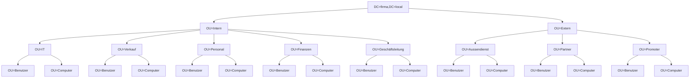

# Dokumentation – Directory Information Tree & Gruppenrichtlinien (GPO)

Domäne: `firma.local`

## Inhaltsverzeichnis

1. [Einleitung](#1-einleitung)
2. [Directory Information Tree (DIT)](#2-directory-information-tree-dit)
3. [Struktur im AD anlegen](#3-struktur-im-ad-anlegen)
4. [Benutzer in die passenden OUs verschieben](#4-benutzer-in-die-passenden-ous-verschieben)
5. [Gruppenrichtlinien](#5-gruppenrichtlinien)
6. [Fazit](#6-fazit)

---

## 1. Einleitung

Diese Dokumentation beschreibt die Planung und Umsetzung eines Directory Information Tree (DIT) für die fiktive Firma **firma.local** sowie die anschliessende Umsetzung verschiedener Gruppenrichtlinien-Szenarien (Passwortrichtlinien, Netzlaufwerke, Desktop-Verknüpfungen, WMI-Filter, Drucker- und Softwareverteilung).

Als Abteilungen wurden für dieses Beispiel definiert:

| Bereich | Abteilungen |
|---|---|
| **Intern** | IT, Verkauf, Personal, Finanzen, Geschäftsleitung |
| **Extern** | Aussendienst, Partner, Promoter |

## 2. Directory Information Tree (DIT)

### 2.1 Vorgaben

- Jede Abteilung kommt nur einmal als eigene Organisationseinheit vor.
- `Intern` und `Extern` bilden je eine eigenständige Ebene direkt unterhalb der Domäne.
- Die unterste Ebene jeder Abteilung trennt konsequent zwischen `Benutzer`- und `Computer`-Konten.

### 2.2 DIT-Diagramm



### 2.3 Distinguished Names (Beispiele)

**Benutzer** – Anna Meier, IT, intern:

```
CN=Anna Meier,OU=Benutzer,OU=IT,OU=Intern,DC=firma,DC=local
```

**Computer** – Client der Verkaufsabteilung, intern:

```
CN=PC-VK-010,OU=Computer,OU=Verkauf,OU=Intern,DC=firma,DC=local
```

## 3. Struktur im AD anlegen

Die im DIT definierte Struktur wurde per PowerShell im AWS Managed AD angelegt:

```powershell
$domain = "DC=firma,DC=local"

New-ADOrganizationalUnit -Name "Intern" -Path $domain
New-ADOrganizationalUnit -Name "Extern" -Path $domain

$internAbteilungen = "IT", "Verkauf", "Personal", "Finanzen", "Geschäftsleitung"
foreach ($abt in $internAbteilungen) {
    New-ADOrganizationalUnit -Name $abt -Path "OU=Intern,$domain"
    New-ADOrganizationalUnit -Name "Benutzer" -Path "OU=$abt,OU=Intern,$domain"
    New-ADOrganizationalUnit -Name "Computer" -Path "OU=$abt,OU=Intern,$domain"
}

$externAbteilungen = "Aussendienst", "Partner", "Promoter"
foreach ($abt in $externAbteilungen) {
    New-ADOrganizationalUnit -Name $abt -Path "OU=Extern,$domain"
    New-ADOrganizationalUnit -Name "Benutzer" -Path "OU=$abt,OU=Extern,$domain"
    New-ADOrganizationalUnit -Name "Computer" -Path "OU=$abt,OU=Extern,$domain"
}
```

Kontrolle der erstellten Struktur:

```powershell
Get-ADOrganizationalUnit -Filter * | Select-Object Name, DistinguishedName | Sort-Object DistinguishedName
```

## 4. Benutzer in die passenden OUs verschieben

Die bestehenden Benutzerkonten wurden anhand ihres `Department`-Attributs automatisiert in die passende OU verschoben:

```powershell
$mapping = @{
    "IT"               = "OU=Benutzer,OU=IT,OU=Intern,DC=firma,DC=local"
    "Verkauf"          = "OU=Benutzer,OU=Verkauf,OU=Intern,DC=firma,DC=local"
    "Personal"         = "OU=Benutzer,OU=Personal,OU=Intern,DC=firma,DC=local"
    "Finanzen"         = "OU=Benutzer,OU=Finanzen,OU=Intern,DC=firma,DC=local"
    "Geschäftsleitung" = "OU=Benutzer,OU=Geschäftsleitung,OU=Intern,DC=firma,DC=local"
    "Aussendienst"     = "OU=Benutzer,OU=Aussendienst,OU=Extern,DC=firma,DC=local"
    "Partner"          = "OU=Benutzer,OU=Partner,OU=Extern,DC=firma,DC=local"
    "Promoter"         = "OU=Benutzer,OU=Promoter,OU=Extern,DC=firma,DC=local"
}

foreach ($abt in $mapping.Keys) {
    Get-ADUser -Filter "Department -eq '$abt'" |
        Move-ADObject -TargetPath $mapping[$abt]
}
```

Die Kontrolle erfolgte anschliessend sowohl grafisch im **draw.io**-Diagramm (Abgleich Soll/Ist) als auch direkt in `dsa.msc`, indem jede OU geöffnet und die Zuordnung der Benutzer- und Computerkonten überprüft wurde.

## 5. Gruppenrichtlinien

Für alle in diesem Kapitel erstellten GPOs wird die in **Kapitel 5.4** vorgegebene Namenskonvention verwendet:

```
GPO_<Geltungsbereich>_<Funktion>
```

Beispiel: `GPO_IT_Netzlaufwerk-Abteilung` = GPO, gültig für die OU `IT`, mit der Funktion "Netzlaufwerk-Abteilung".

### 5.1 Teil 1 – Passwortrichtlinien in der Default Domain Policy

In der **Default Domain Policy** wurden ausschliesslich folgende zwei Einstellungen angepasst (unter *Computerkonfiguration → Richtlinien → Windows-Einstellungen → Sicherheitseinstellungen → Kontorichtlinien → Kennwortrichtlinien*):

| Einstellung | Wert |
|---|---|
| Kennwort muss Komplexitätsvoraussetzungen entsprechen | **Deaktiviert** |
| Maximales Kennwortalter | **0** (kein Erzwingen einer Änderung) |

Alle übrigen Einstellungen der Default Domain Policy wurden unverändert belassen, da diese Anpassung nur für die Testumgebung gilt.

### 5.2 Teil 2 – Netzlaufwerke per GPO verteilen

Es wurden folgende GPOs erstellt und jeweils direkt mit der passenden OU verknüpft (kein Item-Level-Targeting):

| GPO-Name | Verknüpft mit | Laufwerksbuchstabe | UNC-Pfad |
|---|---|---|---|
| `GPO_Global_Netzlaufwerk-Pool` | Domain-Stammebene | `P:` | `\\dc01\Pool` |
| `GPO_Intern_Netzlaufwerk-Intern` | OU `Intern` | `I:` | `\\dc01\Intern` |
| `GPO_Extern_Netzlaufwerk-Extern` | OU `Extern` | `X:` | `\\dc01\Extern` |
| `GPO_IT_Netzlaufwerk-Abteilung` | OU `IT` | `H:` | `\\dc01\IT$` |
| `GPO_Verkauf_Netzlaufwerk-Abteilung` | OU `Verkauf` | `H:` | `\\dc01\Verkauf$` |
| `GPO_Personal_Netzlaufwerk-Abteilung` | OU `Personal` | `H:` | `\\dc01\Personal$` |
| `GPO_Finanzen_Netzlaufwerk-Abteilung` | OU `Finanzen` | `H:` | `\\dc01\Finanzen$` |
| `GPO_Geschäftsleitung_Netzlaufwerk-Abteilung` | OU `Geschäftsleitung` | `H:` | `\\dc01\GL$` |

Konfiguration jeweils unter *Benutzerkonfiguration → Einstellungen → Windows-Einstellungen → Zuordnung von Laufwerken*, Aktion **Erstellen**.

### 5.3 Teil 3 – Desktop-Verknüpfung mit positiver Sicherheitsfilterung

- **GPO-Name:** `GPO_Global_CRM-Verknüpfung`
- **Verknüpft mit:** Domain-Stammebene (oberste Ebene)
- **Einstellung:** *Benutzerkonfiguration → Einstellungen → Windows-Einstellungen → Verknüpfungen* → neue Verknüpfung auf `https://crm.webapp.ch`, Zielort Desktop des Benutzers.

**Sicherheitsfilterung (positiv):**

| Gruppe | Berechtigung |
|---|---|
| Authentifizierte Benutzer | **Entfernt** |
| `Intern` (Sicherheitsgruppe, enthält alle internen Benutzer) | Lesen + Gruppenrichtlinie übernehmen |

Getestet wurde die Verteilung mit `gpresult /r` auf je einem internen und einem externen Testclient: Beim internen Client erschien die Verknüpfung nach `gpupdate /force` und Neuanmeldung auf dem Desktop, beim externen Client nicht.

### 5.4 Teil 4 – GPO mit WMI-Filter

**WMI-Filter** `Filter_Windows10` mit folgender WQL-Abfrage (erkennt ausschliesslich Windows-10-Arbeitsstationen):

```sql
SELECT * FROM Win32_OperatingSystem WHERE Version LIKE "10.0%" AND ProductType = "1"
```

**GPO:** `GPO_Promoter_Textdatei-kopieren`

- Verknüpft mit OU `Promoter`
- WMI-Filter `Filter_Windows10` zugewiesen
- Auf der Freigabe `Pool` wurde die leere Datei `WMI-Filter.txt` abgelegt: `\\dc01\Pool\WMI-Filter.txt`
- Konfiguration unter *Benutzerkonfiguration → Einstellungen → Windows-Einstellungen → Dateien*:

| Feld | Wert |
|---|---|
| Aktion | Erstellen |
| Quelldatei | `\\dc01\Pool\WMI-Filter.txt` |
| Zielpfad (inkl. Dateiname) | `%temp%\WMI-Filter.txt` |

Im Reiter **Allgemein** wurde zusätzlich die Option **„Im Sicherheitskontext des angemeldeten Benutzers ausführen (Benutzerrichtlinien-Option)"** aktiviert, damit die Kopie mit den Rechten des jeweiligen Benutzers statt des Computerkontos erfolgt.

Export der Auswertung:

```powershell
gpresult /h gpo.html
```

Die Datei `gpo.html` wurde anschliessend im Team-Repository (Teams) abgelegt.

### 5.5 Teil 5 – Farb- und SW-Drucker verteilen

Auf dem Druckserver `print01.firma.local` wurde ein fiktiver Farblaserdrucker mit der IP-Adresse `192.168.10.50` **zweimal** installiert:

| Druckername | Freigabename | Standard-Farbeinstellung |
|---|---|---|
| Drucker_Farbe | `Drucker_Farbe` | Farbe |
| Drucker_SW | `Drucker_SW` | Schwarzweiss |

Die Standardwerte wurden in den Druckereinstellungen (Voreinstellungen → Farbe) entsprechend angepasst und für alle Benutzer übernommen:


Beide Drucker wurden freigegeben (Rechtsklick → Freigabe → Freigabename wie oben).

**GPO:** `GPO_Global_Druckerverteilung`, verknüpft mit der Domain-Stammebene, unter *Computerkonfiguration → Einstellungen → Systemsteuerung → Drucker* → **Freigegebener Drucker**:

| Feld | Wert |
|---|---|
| Aktion | Aktualisieren |
| UNC-Pfad Drucker 1 | `\\print01.firma.local\Drucker_Farbe` |
| UNC-Pfad Drucker 2 | `\\print01.firma.local\Drucker_SW` |


**Test:** Beide Drucker wurden auf dem Testclient manuell gelöscht und anschliessend mit `gpupdate /force` neu installiert; das erfolgreiche Wiederherstellen beider Drucker wurde per Video dokumentiert und im Repository abgelegt.

### 5.6 Teil 6 – MSI-Paket per GPO verteilen (7-Zip)

1. Freigabeordner erstellt: `\\dc01\Software$` (NTFS- und Freigabeberechtigung: **Domänen-Computer** = Lesen, **Domänen-Admins** = Vollzugriff).
2. Aktuelles 7-Zip-MSI heruntergeladen und in die Freigabe kopiert: `\\dc01\Software$\7-Zip\7z2408-x64.msi`.
3. **GPO:** `GPO_Global_7Zip-Installation` (Computereinstellung), verknüpft mit der gesamten Domäne, unter *Computerkonfiguration → Richtlinien → Softwareeinstellungen → Softwareinstallation* → neues Paket, Bereitstellungsmethode **Zugewiesen**.
4. Sicherheitsgruppe **`7-Zip`** erstellt. Da die klassische Softwareinstallation über GPO kein natives Item-Level-Targeting kennt, wurde die Zielgruppenadressierung über **Sicherheitsfilterung** des GPOs umgesetzt:
   - Gruppe **Authentifizierte Computer** aus der Sicherheitsfilterung entfernt
   - Gruppe **`7-Zip`** hinzugefügt, mit den Berechtigungen **Lesen** und **Gruppenrichtlinie übernehmen**
   - Dadurch erhalten ausschliesslich Computerkonten, die Mitglied der Gruppe `7-Zip` sind, das Paket bei nächstem Neustart bzw. `gpupdate /force`
5. **Fehler %%1274** trat auf, da die Computerkonten beim Start (LocalSystem-Kontext) noch keinen authentifizierten Benutzerzugriff auf die Freigabe hatten. Behoben durch Erweiterung der Berechtigungen auf der Freigabe `Software$`:
   - NTFS-Berechtigung: **Jeder / Everyone** → Lesen
   - Freigabeberechtigung: **Jeder / Everyone** → Lesen
6. Erfolgreiche Installation wurde in der **Ereignisanzeige** des Testclients nachgewiesen: *Windows-Protokolle → Anwendung*, Quelle `MsiInstaller`, Ereignis-ID `1042`/`11707` ("Product: 7-Zip -- Installation completed successfully").

## 6. Fazit

Die Kombination aus einem sauber geplanten Directory Information Tree und einer konsequenten OU-Struktur (getrennt nach Intern/Extern, je Abteilung mit eigener Benutzer- und Computer-OU) hat die spätere Verteilung der Gruppenrichtlinien erheblich vereinfacht, da GPOs gezielt auf einzelne OUs statt auf einzelne Benutzer verknüpft werden konnten. Die grösste Herausforderung stellte Teil 6 dar: Die klassische GPO-Softwareinstallation unterstützt kein echtes Item-Level-Targeting, weshalb die Einschränkung auf die Gruppe `7-Zip` über Sicherheitsfilterung realisiert wurde. Zusätzlich zeigte der Fehler %%1274, wie wichtig die Berechtigungsprüfung auf Freigabeebene ist, da Computerkonten beim Systemstart noch nicht als authentifizierter Benutzer, sondern im Systemkontext auf Netzwerkfreigaben zugreifen.
